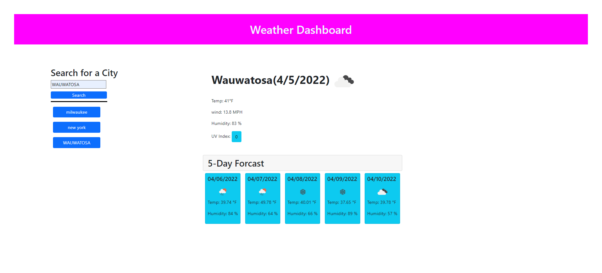
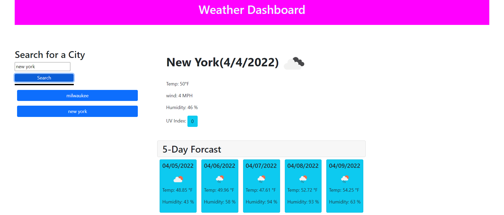

# 06-02-challege

## Description

Use the OpenWeather One Call API to retrieve weather data for cities. Built this weather app to demonstrate the use of server side API throgh JavaScript. This app solves the problem of finding the weather for a city amd being able to store it in a localstorage to be called to in search history. I learned how to create a web application that uses third party API to display data from a json object.

## Table of Contents

- [Installation](#installation)
- [Usage](#usage)
- [Credits](#credits)
- [License](#license)

## Installation

First you would have to run the 
git clone https://github.com/JaberSE09/06-02-challege.git and run the index.html file.

## Usage
https://jaberse09.github.io/06-02-challege/ is tje link to the live website and https://github.com/JaberSE09/06-02-challege is the link to the code on github.


    ```md
    
)
    ```

    ```md
    
    ```


    ```md
    
    ```


## Credits

Sajid Jaber

## License

MIT License

Copyright (c) [2022] [Sajid Jaber]

Permission is hereby granted, free of charge, to any person obtaining a copy
of this software and associated documentation files (the "Software"), to deal
in the Software without restriction, including without limitation the rights
to use, copy, modify, merge, publish, distribute, sublicense, and/or sell
copies of the Software, and to permit persons to whom the Software is
furnished to do so, subject to the following conditions:

The above copyright notice and this permission notice shall be included in all
copies or substantial portions of the Software.

THE SOFTWARE IS PROVIDED "AS IS", WITHOUT WARRANTY OF ANY KIND, EXPRESS OR
IMPLIED, INCLUDING BUT NOT LIMITED TO THE WARRANTIES OF MERCHANTABILITY,
FITNESS FOR A PARTICULAR PURPOSE AND NONINFRINGEMENT. IN NO EVENT SHALL THE
AUTHORS OR COPYRIGHT HOLDERS BE LIABLE FOR ANY CLAIM, DAMAGES OR OTHER
LIABILITY, WHETHER IN AN ACTION OF CONTRACT, TORT OR OTHERWISE, ARISING FROM,
OUT OF OR IN CONNECTION WITH THE SOFTWARE OR THE USE OR OTHER DEALINGS IN THE
SOFTWARE.